# 건물주 정보구조도 (IA)

## 메타
| 항목 | 내용 |
|------|------|
| 서비스명 | 건물주 |
| 플랫폼 | 앱(iOS/Android) + 웹뷰 병행 |
| 주요 대상 | 임대인(노년층 다수 포함), 임차인, 보조 관리자, 보조 열람자, 주거래 중개사(웹 백오피스) |
| 핵심 도메인 | 주거래 중개사 연동(B2B2C), 입주 정보 인수인계, 전자서명 계약, 금액 상호 확인, 퇴거 정산 계산기 |
| 작성일 | 2026-07-15 (수정 2026-07-19) |

## 설계 원칙 반영 사항
- 임대인 화면은 전 구간 **선택형/터치형 UI** 우선 (자유 텍스트 입력 최소화, 넘버패드·카드버튼·사진촬영 위주)
- 임차인은 **초대링크(웹뷰) 진입**이 기본 경로이며 앱 설치는 선택
- 노년층 임대인 보조를 위한 **보조 관리자(자녀)** 계정 구조 반영

---

## 화면 목록

### A. 공통/인증

| 화면ID | 화면명 | Depth | 상위화면 | 주요 콘텐츠 | 주요 기능 | 데이터 소스 | 접근권한 |
|--------|--------|-------|----------|-------------|-----------|-------------|----------|
| COM-001 | 스플래시 | 1 | - | 로고, 로딩 인디케이터 | 자동 로그인 확인, 앱 초기화 | Local | G |
| COM-002 | 역할 선택 | 1 | COM-001 | "임대인으로 시작" / "초대코드로 입장" 버튼 2개 | 역할 분기 진입 | Static | G |
| COM-003 | 본인인증 로그인 | 2 | COM-002 | 휴대폰 번호, PASS/카카오 인증 버튼 | 간편인증 로그인, 자동 회원가입 | API | G |
| COM-004 | 최초 이용 안내(1분 영상) | 2 | COM-003 | 사용법 영상/이미지 카드, 큰 "다음" 버튼 | 온보딩 스킵/재생 | Static | U |
| COM-005 | 알림센터 | 2 | 전역 | 알림 목록(계약, 정산, 승인 요청) | 알림 확인, 딥링크 이동 | API | U |
| COM-006 | 고객센터/전화상담 | 2 | 전역 | 상담 전화번호(하단 고정), FAQ | 전화 연결, FAQ 열람 | Static | G/U |
| COM-007 | 초대링크 진입(웹뷰) | 1 | - | 계약 요약 카드(주소, 임대인명, 보증금/월세) | 계약 미리보기, 본인인증 후 연결 | API | G |

### B. 임대인 (관리)

| 화면ID | 화면명 | Depth | 상위화면 | 주요 콘텐츠 | 주요 기능 | 데이터 소스 | 접근권한 |
|--------|--------|-------|----------|-------------|-----------|-------------|----------|
| LL-001 | 임대인 홈(물건 목록) | 2 | COM-003 | 보유 물건 카드 목록, [나의 주거래 중개사 상시 노출 위젯] | 물건 선택, 건물 등록, 중개사 전화/톡 연결 | API | U |
| LL-002 | 건물 등록 | 3 | LL-001 | 주소 검색, 건물유형, 총 호실수, 건물 사진 | 건물 기본정보 등록 | API | U |
| LL-002a | 호실 목록 | 3 | LL-002 | 호실 카드 리스트(호실번호, 상태: 공실/임대중) | 호실 선택, 신규 호실 등록 | API | U |
| LL-002b | 호실 등록 | 4 | LL-002a | 호실번호/층, 전용면적, 구조, 옵션 카드, 특기사항 | 호실 상세정보 입력 | API | U |
| LL-002c | 호실 상세 | 4 | LL-002a | 면적/옵션/특기사항 요약, 현재 계약정보, 임차인 이력 타임라인 | 정보 수정, [임차인 변경] 진입 | API | U |
| LL-003 | 계약 등록(금액) | 4 | LL-002c | 임차인 정보(이름/연락처), 보증금/월세 숫자패드, 계약일/기간 캘린더, 납부일 선택 | 계약 기본정보 입력 | API | U |
| LL-003a | 임차인 변경 | 4 | LL-002c | 기존계약 종료 확인, 퇴거정산 연계 안내, 신규계약 등록 진입 | 계약종료→정산→신규등록 원스톱 진행 | API | U |
| LL-004 | 입주키트 - 출입보안 | 3 | LL-003 | 공동현관/세대현관/우편함/주차 비밀번호 입력 카드 | 숫자패드 입력, 항목별 건너뛰기 | API | U |
| LL-005 | 입주키트 - 설비생활정보 | 3 | LL-003 | 보일러/인터넷/가스/정화조 선택카드 + 설명서 사진첨부 | 카드 선택, 사진 업로드 | API | U |
| LL-006 | 입주키트 - 관리비 분해 | 3 | LL-003 | 관리비 고지서 촬영, 항목별 자동인식 결과 확인 | 사진촬영 입력, 금액 확인 | API | U |
| LL-007 | 입주키트 - 특약사항 | 3 | LL-003 | 반려동물/흡연/원상복구 범위 선택카드, 장충금 반환주체 | 카드 선택, 직접입력(숨김) | API | U |
| LL-008 | 입주키트 - 비상연락처 | 3 | LL-003 | 임대인/관리업체/설비기사 연락처 카드 | 연락처 입력·전화연결 테스트 | API | U |
| LL-009 | 초대링크 발급 | 3 | LL-003 | 링크 생성 버튼, 문자/카카오 공유 버튼, 만료기한 표시 | 링크 생성, 공유, 재발급 | API | U |
| LL-010 | 계약 목록/상태 | 2 | LL-001 | 계약별 상태(대기/확정/종료) 리스트 | 계약 상세 이동 | API | U |
| LL-011 | 금액 변경 요청 | 3 | LL-010 | 신규 금액 숫자패드, 변경 사유 카드 | 금액 변경 요청 발송 | API | U |
| LL-012 | 금액 확인 결과 | 3 | LL-011 | 임차인 승인 상태, 확인서 미리보기 | 확인서 열람 | API | U |
| LL-013 | 퇴거 정산 계산기 | 3 | LL-010 | 퇴거일, 검침값, 미납내역 입력 카드 | 자동 정산액 계산 | API | U |
| LL-014 | 정산서 확인/서명 | 3 | LL-013 | 정산 내역 요약, 전자서명 패드 | 서명, PDF 발급 | API | U |
| LL-015 | 보조 관리자(자녀) 초대 | 2 | LL-001 | 초대 링크 생성, 권한 범위(열람/입력) 선택 | 보조계정 초대, 권한 관리 | API | U |
| LL-016 | 계약 상세(임대인) | 2 | LL-010 | 입주키트 요약, 하자이력, 서명이력 | 정보 수정, 이력 열람 | API | U |
| LL-017 | 임차료 납부 현황 | 2 | LL-001 | 세대별 이번달 납부상태(완료/미납) 카드 | 납부현황 조회 | API | U |
| LL-018 | 납부 알림 설정 | 3 | LL-017 | 지정 납부일, 알림 발송 시점(문자①~④) 설정 카드 | 자동 발송 스케줄 설정 | API | U |
| LL-019 | 미납자 명단 대장 | 3 | LL-017 | 미납 세대 목록, 미납기간, 연체료 자동계산 | 대장 조회, 엑셀/PDF 내보내기 | API | U |
| LL-020 | 세무 신고자료 생성 | 3 | LL-017 | 기간 선택, 임대소득 현황 요약 | 신고용 자료 자동 생성·다운로드 | API | U |
| LL-021 | 불편사항 접수함 | 2 | LL-001 | 임차인이 전달한 불편사항 목록 | 확인, 답변, 처리상태 변경 | API | U |
| LL-022 | 공실 현황 대시보드 | 2 | LL-001 | 건물별 공실률, 호실별 공실기간 | 공실 통계 조회 | API | U |
| LL-023 | 계약갱신 관리 | 2 | LL-001 | 계약만료 임박 호실 목록(D-60/D-30 뱃지) | 갱신여부 표시, [주거래 중개사에게 즉시 방 내놓기] 진입 | API | U |
| LL-024 | 시세 참고자료 (준비중) | 4 | LL-002c | "준비중" 안내 문구, 향후 기능 소개 1줄 | 메뉴 진입만 제공(로직 없음) | Static | U |
| LL-025 | 매물카드 자동생성 | 4 | LL-002c | 호실 정보(옵션/특약/면적) 기반 매물카드 요약본 | [주거래 중개사에게 매물 의뢰 발송] | API | U |

### C. 임차인

| 화면ID | 화면명 | Depth | 상위화면 | 주요 콘텐츠 | 주요 기능 | 데이터 소스 | 접근권한 |
|--------|--------|-------|----------|-------------|-----------|-------------|----------|
| TN-001 | 임차인 홈(계약 요약) | 2 | COM-007 | 계약 요약카드, 입주키트 진행률 | 상세 이동 | API | U |
| TN-002 | 계약정보 확인/승인 | 3 | TN-001 | 계약 요약서, [확인했습니다] 버튼 | 계약 승인, 전자서명 | API | U |
| TN-003 | 입주키트 열람 | 3 | TN-001 | 출입정보, 설비정보, 특약사항 탭 뷰 | 정보 열람, 복사 | API | U |
| TN-004 | 정보 요청하기 | 4 | TN-003 | 미입력 항목 리스트, "임대인에게 요청" 버튼 | 알림 발송 | API | U |
| TN-005 | 입주 하자 스탬프 등록 | 3 | TN-001 | 사진 촬영(위치태그 자동), 하자 목록 | 사진 등록, 위치태그 선택 | API | U |
| TN-006 | 금액 확인/승인 | 3 | TN-001 | 변경 금액 요약카드, [확인했습니다] 버튼 | 금액 승인, 전자서명 | API | U |
| TN-007 | 퇴거정산 확인/서명 | 3 | TN-001 | 정산 내역 요약, 보증금 반환 예상액 | 정산 확인, 서명 | API | U |
| TN-008 | 보조 열람자 초대 | 2 | TN-001 | 초대 링크 생성 | 보조 계정 초대 | API | U |
| TN-009 | 임차료 납부 안내 | 2 | TN-001 | 이번달 납부금액, 납부기한, 계좌정보 | 알림 확인, 납부 실행 연결 | API | U |
| TN-010 | 불편사항 전달 | 3 | TN-001 | 카테고리 선택(누수/소음/설비고장 등), 사진첨부 | 불편사항 접수, 처리상태 확인 | API | U |

### D. 공통 전자서명

| 화면ID | 화면명 | Depth | 상위화면 | 주요 콘텐츠 | 주요 기능 | 데이터 소스 | 접근권한 |
|--------|--------|-------|----------|-------------|-----------|-------------|----------|
| SIGN-001 | 전자서명 실행 | 3 | LL-014, TN-002, TN-006, TN-007 | 서명 대상 문서 요약, 서명 패드/간편인증 | 서명 실행 | API | U |
| SIGN-002 | 서명완료 확인서 | 3 | SIGN-001 | 완료 PDF 미리보기 | PDF 다운로드/공유 | API | U |

### E. 관리자

| 화면ID | 화면명 | Depth | 상위화면 | 주요 콘텐츠 | 주요 기능 | 데이터 소스 | 접근권한 |
|--------|--------|-------|----------|-------------|-----------|-------------|----------|
| ADM-001 | 관리자 대시보드 | 1 | - | 가입자수, 계약수, 정산 건수 통계 | 통계 조회 | API | A |
| ADM-002 | 사용자 관리 | 2 | ADM-001 | 사용자 목록, 상태 | 계정 정지/복구 | API | A |
| ADM-003 | 신고/분쟁 모니터링 | 2 | ADM-001 | 분쟁 신고 목록 | 처리 상태 변경 | API | A |

### F. 주거래 중개사 (웹 백오피스)

| 화면ID | 화면명 | Depth | 상위화면 | 주요 콘텐츠 | 주요 기능 | 데이터 소스 | 접근권한 |
|--------|--------|-------|----------|-------------|-----------|-------------|----------|
| AGT-001 | 중개사 로그인/가입 | 1 | - | 사업자등록증 사본 업로드, 사업자등록번호 | 가입 신청, 공공데이터포털 진위확인(무료API) | API | G |
| AGT-002 | 중개사 대시보드 | 2 | AGT-001 | 관리 임대인 수, 계약만기 건수, 신규 매물 접수 현황 | 통계 요약 및 주요 기능 퀵메뉴 | API | A(agt) |
| AGT-003 | 임대인 초대 | 3 | AGT-002 | 중개사 고유 초대링크 및 QR코드 | 카카오톡/문자 발송 (가입 시 주거래 중개사 락인) | API | A(agt) |
| AGT-004 | 고객(건물주) 관리장부 | 3 | AGT-002 | 가입된 임대인 리스트 및 보유 건물/호실 현황 | 임대인 자산 현황 열람, 연락하기 | API | A(agt) |
| AGT-005 | 만기 임박/선제영업 | 3 | AGT-002 | 1~6개월 내 만기 예정 호실 목록 | 선제적 영업 안내 대상자 추출, 상태 메모 | API | A(agt) |
| AGT-006 | 매물 관리 (정상/급매/예상 밖) | 3 | AGT-002 | 임대인이 "방 내놓기"로 접수한 매물, 예상 밖 발생 매물 | 매물 접수, 상태관리(접수/중개중/완료), 급매/돌발 건 별도 태깅 | API | A(agt) |
| AGT-007 | 소속 직원 관리 | 3 | AGT-002 | 사무소 소속 직원(소속공인중개사, 중개보조원) 목록 | 직원 초대(링크/QR), 계정 정지, 권한 관리 | API | A(agt_master) |

---

## 계층 다이어그램

```mermaid
graph TD
  Root[건물주] --> Auth[공통/인증]
  Root --> LLTAB[임대인 탭]
  Root --> TNTAB[임차인 탭]
  Root --> SIGN[전자서명 공통]
  Root --> ADMTAB[관리자]
  Root --> AGTTAB[주거래 중개사 웹]

  Auth --> COM001[COM-001 스플래시]
  Auth --> COM002[COM-002 역할선택]
  Auth --> COM003[COM-003 본인인증]
  Auth --> COM004[COM-004 온보딩]
  Auth --> COM005[COM-005 알림센터]
  Auth --> COM006[COM-006 고객센터]
  Auth --> COM007[COM-007 초대링크 웹뷰]

  LLTAB --> LL001[LL-001 물건목록]
  LL001 --> LL002[LL-002 건물등록]
  LL002 --> LL002a[LL-002a 호실목록]
  LL002a --> LL002b[LL-002b 호실등록]
  LL002a --> LL002c[LL-002c 호실상세]
  LL002c --> LL003[LL-003 계약등록]
  LL002c --> LL003a[LL-003a 임차인변경]
  LL003 --> LL004[LL-004 입주키트-출입보안]
  LL003 --> LL005[LL-005 입주키트-설비]
  LL003 --> LL006[LL-006 입주키트-관리비]
  LL003 --> LL007[LL-007 입주키트-특약]
  LL003 --> LL008[LL-008 입주키트-비상연락처]
  LL003 --> LL009[LL-009 초대링크발급]
  LL001 --> LL010[LL-010 계약목록]
  LL010 --> LL011[LL-011 금액변경요청]
  LL011 --> LL012[LL-012 금액확인결과]
  LL010 --> LL013[LL-013 퇴거정산계산기]
  LL013 --> LL014[LL-014 정산서서명]
  LL001 --> LL015[LL-015 보조관리자초대]
  LL010 --> LL016[LL-016 계약상세]
  LL001 --> LL017[LL-017 임차료납부현황]
  LL017 --> LL018[LL-018 납부알림설정]
  LL017 --> LL019[LL-019 미납자명단대장]
  LL017 --> LL020[LL-020 세무신고자료생성]
  LL001 --> LL021[LL-021 불편사항접수함]
  LL001 --> LL022[LL-022 공실현황대시보드]
  LL001 --> LL023[LL-023 계약갱신관리]
  LL002c --> LL024[LL-024 시세참고자료-준비중]
  LL002c --> LL025[LL-025 매물카드생성-준비중]

  TNTAB --> TN001[TN-001 계약요약홈]
  TN001 --> TN002[TN-002 계약승인]
  TN001 --> TN003[TN-003 입주키트열람]
  TN003 --> TN004[TN-004 정보요청]
  TN001 --> TN005[TN-005 하자스탬프등록]
  TN001 --> TN006[TN-006 금액확인승인]
  TN001 --> TN007[TN-007 퇴거정산확인]
  TN001 --> TN008[TN-008 보조열람자초대]
  TN001 --> TN009[TN-009 임차료납부안내]
  TN001 --> TN010[TN-010 불편사항전달]

  SIGN --> SIGN001[SIGN-001 전자서명]
  SIGN001 --> SIGN002[SIGN-002 서명완료확인서]

  ADMTAB --> ADM001[ADM-001 대시보드]
  ADM001 --> ADM002[ADM-002 사용자관리]
  ADM001 --> ADM003[ADM-003 분쟁모니터링]

  AGTTAB --> AGT001[AGT-001 가입/인증]
  AGT001 --> AGT002[AGT-002 대시보드]
  AGT002 --> AGT003[AGT-003 임대인초대]
  AGT002 --> AGT004[AGT-004 고객관리장부]
  AGT002 --> AGT005[AGT-005 만기/선제영업]
  AGT002 --> AGT006[AGT-006 매물/급매관리]
  AGT002 --> AGT007[AGT-007 소속직원관리]

  style Root fill:#4F46E5,color:#fff
  style Auth fill:#7C3AED,color:#fff
  style LLTAB fill:#0891B2,color:#fff
  style TNTAB fill:#059669,color:#fff
  style SIGN fill:#D97706,color:#fff
  style ADMTAB fill:#DC2626,color:#fff
  style AGTTAB fill:#15803d,color:#fff
```

